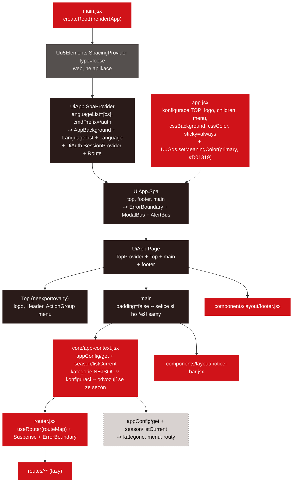
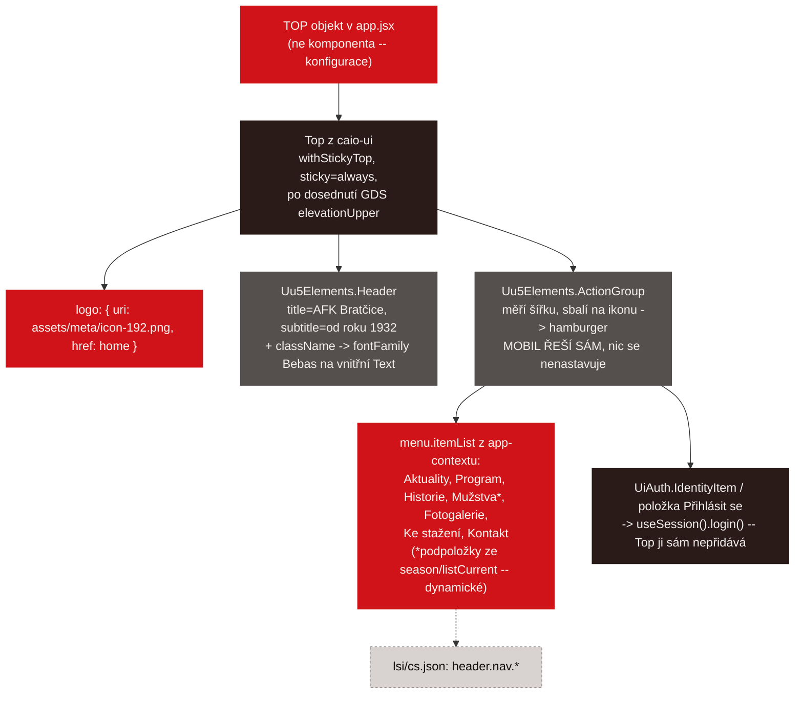
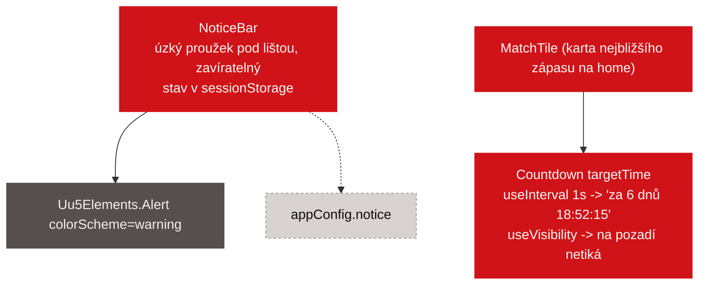
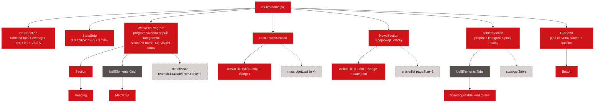
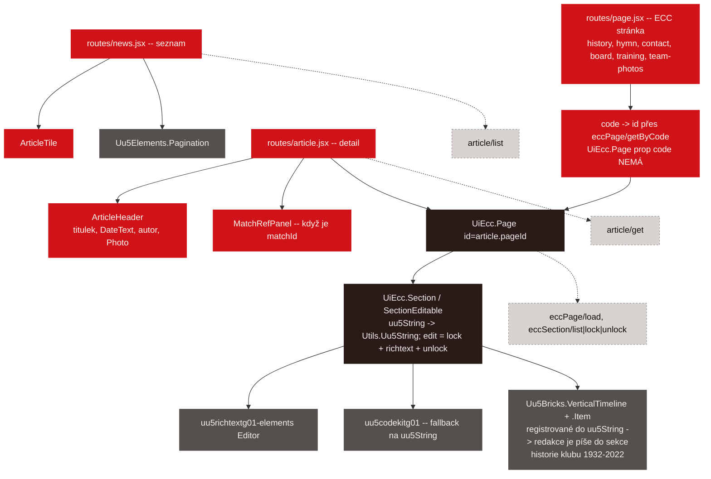
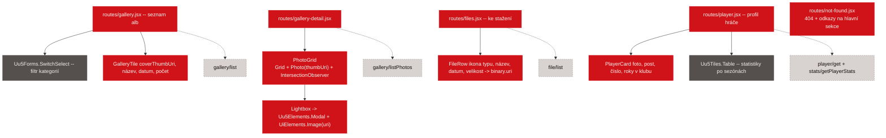
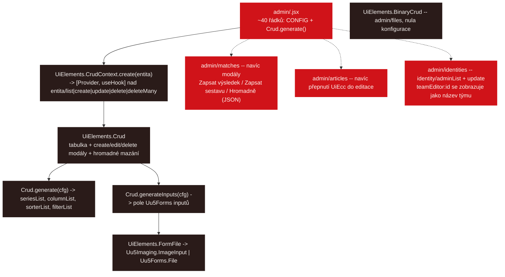

# Strom komponent — z čeho se web složí

Datum: 2026-09-05

**Co tenhle dokument je:** rozpad každé obrazovky na komponenty, s vyznačením, co dodává
`uu5g05`, co `caio-ui` a co si musí appka napsat sama. Slouží k odhadu práce a k tomu, aby se
při implementaci nezakládaly vlastní komponenty tam, kde už něco existuje.

**Co není:** zadání (to je [frontend.md](./frontend.md)) ani vzhled
(to je [ux-design-system.md](./ux-design-system.md)).

Na rozdíl od `caio_propertyman/docs/component-tree.md` je tu jen **cílový stav** — appka
zatím neexistuje, není co odečítat ze zdrojáků.

> **Základní pravidlo:** červený uzel (naše komponenta) je vždycky **jen složení a konfigurace**
> uu5 komponent, ne vlastní HTML se stylem. Kde v diagramu vidíte krémový uzel (holé HTML),
> je to buď záměr (sémantika `<section>`, `<h2>`, `<table>`), nebo dluh — a je u něj napsáno co.

---

## Legenda diagramů

| Barva | Význam |
| --- | --- |
| červená | naše komponenta (`client/src/components/**`, `routes/**`) |
| tmavě hnědá | komponenta z `caio-ui` (`UiApp`, `UiAuth`, `UiElements`, `UiEcc`) |
| šedá | komponenta z uu5 (`Uu5Elements`, `Uu5Forms`, `Uu5Tiles`, `Uu5Imaging`) |
| světlá | sémantické HTML + `Config.Css.css()` |
| přerušovaná | data: use case API, `content/*.js` nebo klíč v `lsi/cs.json` |

```
classDef own  fill:#D01319,color:#FEF7F2,stroke:#D01319
classDef caio fill:#2A1B19,color:#F3EFED,stroke:#2A1B19
classDef uu5  fill:#55504E,color:#F3EFED,stroke:#55504E
classDef html fill:#F3EFED,color:#120D0C,stroke:#99908E
classDef data fill:#D8D2D0,color:#120D0C,stroke:#99908E,stroke-dasharray:3 3
```

---

# Část A — rám aplikace

Rám **dodává `caio-ui`**: `UiApp.Spa` dostane `top`, `footer` a `main` a složí lištu +
`<main>` + patičku. Appka nemá vlastní `Page` ani `Header` — jen konfiguraci v `app.jsx`.



## A.1 Horní lišta



**Past:** `Uu5Elements.Header` nemá token pro font — title i subtitle renderuje jako
`Uu5Elements.Text` s vlastní explicitní `font-family`. Bebas Neue se do něj dostane jen
cílenou třídou na `[data-name="Uu5Elements.Text"]`; je to **schválené přebití**, patří do
`decisions.md` (stejně to řeší propertyman).

---

# Část B — sdílené primitivy

Na tyhle uzly se odkazují všechny diagramy níž. Je to celý „design systém“ appky —
devět komponent, každá tenká obálka nad uu5.

```mermaid
flowchart TD
  section["Section<br/>variant=plain|hatched|red, id, padTop<br/>maxWidth 1152, padInline 16|24, padBlock 64"]:::own
  bgp["Uu5Elements.BackgroundProvider<br/>background=dark (celý web je tmavý)<br/>-> uu5 potomci volí správnou variantu z GDS"]:::uu5
  sectionEl["section (sémantické HTML) + div"]:::html

  heading["Heading level, eyebrow<br/>eyebrow + h2 s červeným pruhem 4px vlevo"]:::own
  text["Uu5Elements.Text category/segment/type<br/>VELIKOST VŽDY Z uuGds -- theme.js nemá fontSize<br/>children jako funkce -> style; GDS řeší i smallScreen"]:::uu5
  headingEl["h1 | h2 | h3, margin 0<br/>+ fontFamily, letterSpacing, textTransform z theme"]:::html

  eyebrow["Eyebrow<br/>12/16, ls .25em, uppercase, barva clubRed"]:::own

  card["Card highlighted?, topStripe?"]:::own
  tile["Uu5Elements.Tile<br/>colorScheme dle GDS, borderRadius=moderate,<br/>padding ze SpacingProvideru"]:::uu5

  button["Button variant=solid|outline, size, href"]:::own
  uubtn["Uu5Elements.Button<br/>significance highlighted|common<br/>colorScheme=primary (#D01319)"]:::uu5

  grid["Uu5Elements.Grid<br/>templateColumns {xs:1fr, m:repeat(3,1fr)}"]:::uu5

  badge["Badge kind=category|result<br/>A-TÝM / MLÁDEŽ / VETERÁNI, VÝHRA / REMÍZA / PROHRA"]:::own
  uubadge["Uu5Elements.Tag / Uu5Elements.Badge"]:::uu5

  photo["Photo src, ratio, caption, alt"]:::own
  uuimg["UiElements.Image (img + referrerPolicy)<br/>loading=lazy, objectFit=cover"]:::caio

  dt["DateText value, format<br/>jednotné cs-CZ formátování, Intl"]:::own
  logo2["TeamLogo uri, size<br/>fallback na klubový erb"]:::own

  section --> bgp --> sectionEl
  heading --> eyebrow
  heading --> text --> headingEl
  card --> tile
  button --> uubtn
  badge --> uubadge
  photo --> uuimg
  logo2 --> uuimg

  classDef own fill:#D01319,color:#FEF7F2,stroke:#D01319
  classDef caio fill:#2A1B19,color:#F3EFED,stroke:#2A1B19
  classDef uu5 fill:#55504E,color:#F3EFED,stroke:#55504E
  classDef html fill:#F3EFED,color:#120D0C,stroke:#99908E
  classDef data fill:#D8D2D0,color:#120D0C,stroke:#99908E,stroke-dasharray:3 3
```



---

# Část C — bez bočního panelu

Současný web má na každé stránce pravý sloupec (upozornění, poslední/následující zápas,
zkrácená tabulka). **Nová verze ho nemá** — je to dvousloupcový vzor z roku 2010, na mobilu
z něj stejně padá dlouhý ocas pod obsah a předloha ho nezná. Obsah se nezahazuje, jen
přesouvá: upozornění je proužek pod lištou, zápasy a tabulka jsou plné sekce na home.

Jediné, co z panelu zbývá jako komponenty:



`Countdown` je jediná komponenta v celé appce s vlastním intervalem.

---

# Část D — veřejné obrazovky

## D.1 Home



## D.2 Mužstva, soupiska, zápasy, tabulka, statistiky

Čtyři routy jednoho týmu (`team`, `team/matches`, `team/table`, `team/stats`) sdílí hlavičku
s přepínačem sezóny a záložkami — ta je vlastní komponenta, ne čtyři kopie.

```mermaid
flowchart TD
  teams["routes/teams.jsx -- přehled mužstev"]:::own
  tcard["TeamCard<br/>Photo + Badge + perex + 3 řádky s ikonami + Button"]:::own

  shell["TeamShell id, seasonId<br/>hlavička + SeasonSelect + Uu5Elements.Tabs"]:::own
  ssel["SeasonSelect -> Uu5Forms.Select"]:::own

  roster["routes/team.jsx -- soupiska"]:::own
  ptile["PlayerTile<br/>foto, číslo, jméno, věk, Z/G/ŽK/ČK"]:::own
  grp["PositionGroup Brankáři|Obránci|Záložníci|Útočníci"]:::own
  staff["CoachList -> InfoItem"]:::own

  matches["routes/team-matches.jsx<br/>Tabs Rozpis | Výsledky + ics odkaz"]:::own
  table2["Uu5Tiles.Table (uu5tilesg02)<br/>kolo, datum, domácí, hosté, výsledek"]:::uu5
  filt["Uu5Forms.SwitchSelect vše | doma | venku"]:::uu5
  roundv["routes/round.jsx -- celé kolo soutěže"]:::own
  d6["match/list?seasonId&round"]:::data

  tbl["routes/team-table.jsx"]:::own
  stab["StandingsTable variant=full"]:::own

  stats["routes/team-stats.jsx"]:::own
  stab2["Uu5Tiles.Table -- střelci, karty, starty"]:::uu5

  d1["team/list, season/getCurrent, coach/list"]:::data
  d2["player/list?teamId&active"]:::data
  d3["match/list?teamId&seasonId&state&order"]:::data
  d4["stats/getTable"]:::data
  d5["stats/listPlayerStats"]:::data

  teams --> tcard
  teams -.-> d1
  shell --> ssel
  shell --> roster & matches & tbl & stats
  roster --> grp --> ptile
  roster --> staff
  roster -.-> d2
  matches --> filt
  matches --> table2
  matches -.-> d3
  roundv --> table2
  roundv -.-> d6
  tbl --> stab
  tbl -.-> d4
  stats --> stab2
  stats -.-> d5

  classDef own fill:#D01319,color:#FEF7F2,stroke:#D01319
  classDef uu5 fill:#55504E,color:#F3EFED,stroke:#55504E
  classDef data fill:#D8D2D0,color:#120D0C,stroke:#99908E,stroke-dasharray:3 3
```



`StandingsTable` je **vlastní komponenta, ne `Uu5Tiles.Table`** — má zvýrazněný vlastní tým,
skrývá sloupce VP/PP na `xs` a renderuje `<table>` kvůli sémantice a SEO. Zápasy naopak
`Uu5Tiles.Table` používají, protože chtějí řazení a filtry zdarma.

## D.3 Detail zápasu

```mermaid
flowchart TD
  m["routes/match.jsx"]:::own
  head["MatchHeader<br/>2x TeamLogo, skóre, poločas, penalty, kolo, datum, hřiště"]:::own
  lineup["LineupTable domácí | hosté<br/>základ / střídající, góly, karty"]:::own
  scorers["ScorersList -- souhrn z playerList"]:::own
  round["RoundResults<br/>Ostatní výsledky N. kola -> routa round"]:::own
  h2h["HeadToHead<br/>poslední 3 vzájemné zápasy"]:::own
  arts["ArticleTile[] -- reporty ze zápasu"]:::own
  gal["PhotoGrid -- alba navázaná na zápas"]:::own
  dep["DepartureInfo -- jen profil members"]:::own
  act["Uu5Elements.ActionGroup<br/>Zapsat výsledek | Zapsat sestavu (operatives)"]:::uu5
  modal["Uu5Elements.Modal + Uu5Forms.Form"]:::uu5

  d1["match/get (+ homeTeam, guestTeam, playerList)"]:::data
  d2["match/list?seasonId&round"]:::data
  d3["article/list?matchId"]:::data
  d4["gallery/list?matchId"]:::data

  m --> head & lineup & scorers & round & h2h & arts & gal & dep & act
  act --> modal
  m -.-> d1
  round -.-> d2
  h2h -.-> d5["match/list?teamId&opponentId"]:::data
  arts -.-> d3
  gal -.-> d4

  classDef own fill:#D01319,color:#FEF7F2,stroke:#D01319
  classDef uu5 fill:#55504E,color:#F3EFED,stroke:#55504E
  classDef data fill:#D8D2D0,color:#120D0C,stroke:#99908E,stroke-dasharray:3 3
```



`RoundResults` (**„Ostatní výsledky N. kola“**) je převzaté ze současného webu — v původním
návrhu chybělo.

## D.4 Novinky, článek, obsahová stránka



Obsahové stránky přes ECC: `history` (včetně časové osy milníků), `hymn`, `contact`, `board`
(Výbor AFK), `training`. Redakce je edituje in-place, appka pro ně nemá žádný kód navíc.

## D.5 Fotogalerie, soubory, profil hráče



---

# Část E — správcovské obrazovky

Deset z dvanácti admin obrazovek je **jen konfigurační objekt** — žádná vlastní komponenta.



---

# Část F — souhrn

## F.1 Kolik toho musíme napsat

| Vrstva | Počet | Odkud |
|---|---|---|
| Rám, routing guard, session, CRUD UI, ECC, upload | 0 vlastních | `caio-ui` |
| Primitivy designu (Section, Heading, Eyebrow, Card, Button, Badge, Photo, DateText, TeamLogo) | **9** | vlastní, tenké obálky nad uu5 |
| Globální drobnosti (NoticeBar, Countdown) | **2** | vlastní |
| Doménové komponenty (MatchTile, ResultTile, ArticleTile, PlayerTile, TeamCard, GalleryTile, FileRow, StandingsTable, FormDots, LineupTable, ScorersList, RoundResults, HeadToHead, WeekendProgram, PhotoGrid, Lightbox, MatchHeader, TeamShell, SeasonSelect, PersonSelect, TeamSelect) | **21** | vlastní |
| Veřejné obrazovky | **16** | vlastní, ale skládají se z výše uvedeného |
| Správcovské obrazovky | **12** | 9 z nich je jen `CONFIG` objekt |

Časová osa historie je **`Uu5Bricks.VerticalTimeline`** zaregistrovaná do `uu5String`, aby ji
redakce mohla vkládat do ECC sekcí — vlastní komponenta se nepíše.

`WeekendProgram` je sekce na home, ne routa: program víkendu napříč kategoriemi.

## F.2 Kde uu5 nestačí a proč

| Místo | Co chybí | Řešení |
|---|---|---|
| `Uu5Elements.Header` | token pro `font-family` | schválené přebití `className`em na vnitřní `Text` |
| GDS typografie | `fontFamily`, `letterSpacing`, `textTransform` nejsou tokeny | přimíchávají se z `theme.typography[role].style`; **velikost se nikdy nepřepisuje** |
| GDS váhy vs. Bebas Neue | GDS chce u `hero`/`h5` váhu 700, Bebas má jen 400 | `fontWeight: 400` u rolí sázených Bebasem — jinak by prohlížeč tučnost nasyntetizoval |
| Časová osa historie | `uu5g05-elements` ji nemá | `Uu5Bricks.VerticalTimeline` registrovaná do `uu5String` — viz [frontend.md](./frontend.md), 3.11.1. **uu5g04 je zakázané**, vlastní komponenta se nepíše. |
| GDS paleta | `building` je bílá, tmavé schéma se nepřenastaví | barvy lišty a ploch z `theme.js` přes `cssBackground`/`cssColor` |
| Tabulka soutěže | `Uu5Tiles.Table` neumí zvýraznit řádek klubovou barvou ani skrývat sloupce po breakpointech | vlastní `StandingsTable` nad `<table>` |
| Odpočet do zápasu | uu5 nemá | vlastní `Countdown` (`useInterval` + `useVisibility`) |
| Mapa v kontaktu | uu5 nemá mapovou komponentu | `<iframe>` OpenStreetMap uvnitř `Uu5Elements.Block` |
| Lightbox | `Uu5Elements.Modal` ano, ale bez šipek a swipe | vlastní `Lightbox` nad `Modal` |
| ECC backend | `caio-server` modul nemá | portovat z v1 do `server/ecc/` |

## F.3 Co je vědomě holé HTML

`<section>`, `<h1>`–`<h3>`, `<table>` ve `StandingsTable` a `<iframe>` mapy. Vždy kvůli
sémantice, přístupnosti a SEO — ne kvůli stylu. Všechno ostatní jde přes uu5.
