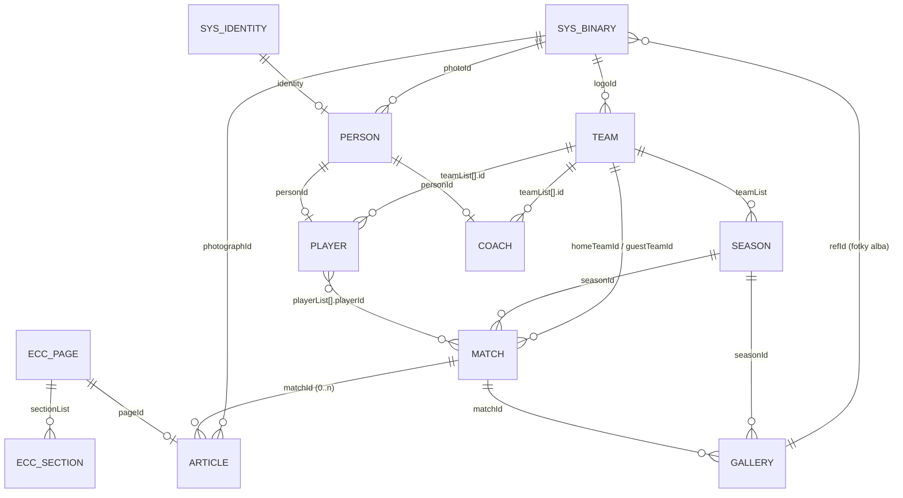
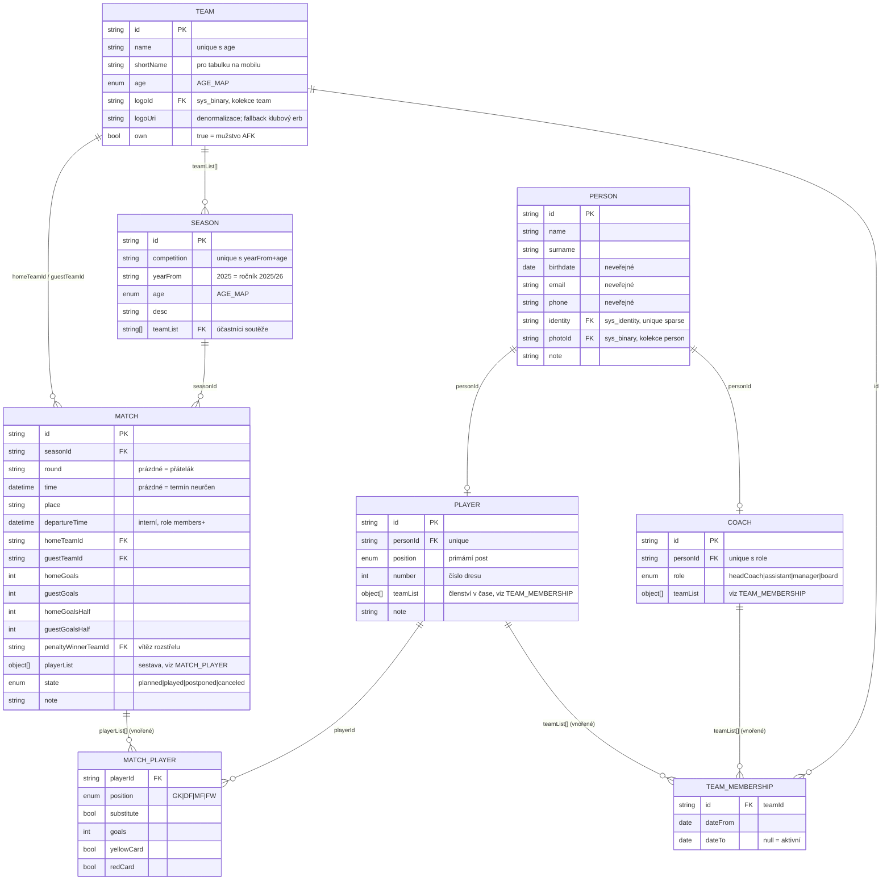
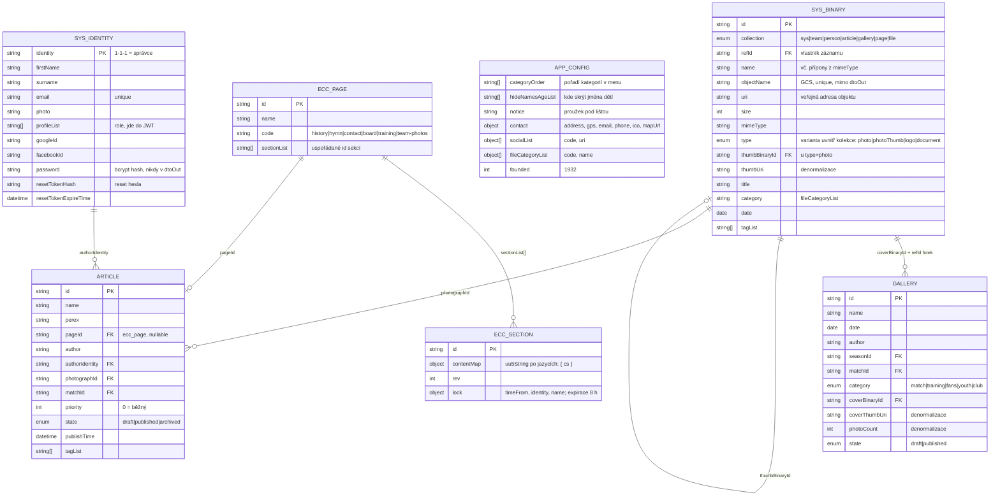

# Datový model

> Aktualizováno 2026-09-05: úložiště souborů je **Google Cloud Storage**, ne Google Drive
> (viz [README.md](./README.md), sekce 3.1) – mění se `sys_binary` (sekce 12) a `gallery`
> (sekce 9). Role a jejich rozsah vlastní [roles.md](./roles.md).

MongoDB, jedna databáze, bez prefixu kolekcí (aplikace je samostatná).
Přístup přes `Dao`, business logika přes `Crud` – obojí z balíčku `caio-server`
(`import { Dao, Crud, Error } from "caio-server"`).

Společné vlastnosti všech kolekcí (zajišťuje `Dao`):

- `_id` (ObjectId) se navenek vždy překládá na `id` (string),
- každý dokument dostane `sys: { cts, mts }` (ISO 8601 string) – klíč `sys` je v `dtoIn`
  rezervovaný a `Dao.create` na něj vyhodí `DaoError`; API ho proto před zápisem odstraňuje,
- `Dao.find` má výchozí `pageSize` 1000; seznamy se stránkují přes `pageInfo`.

---

## 1. Přehled

### 1.1 Mapa vazeb



### 1.2 Sportovní jádro — schémata a vazby



`MATCH_PLAYER` a `TEAM_MEMBERSHIP` **nejsou kolekce** — jsou to vnořené objekty
v `match.playerList`, resp. `player.teamList` / `coach.teamList`. V diagramu stojí zvlášť,
protože bez nich není vidět, co sestava a členství nesou.

### 1.3 Obsah, média a systém



> **`ARTICLE`, `ECC_PAGE` a `ECC_SECTION` zatím nevznikají.** Design ECC se ladí zvlášť
> a do té doby jsou obsahové stránky natvrdo v kódu klienta a články nejsou vůbec —
> viz [README.md](./README.md), sekce 2. V diagramu zůstávají, aby byl cílový model celý.

| Kolekce | Původ | Popis |
|---|---|---|
| `team` | v1 | Tým – vlastní i soupeři, vždy v rámci věkové kategorie |
| `season` | v1 | Ročník soutěže (soutěž + rok + kategorie + účastníci) |
| `match` | v1 | Zápas včetně výsledku a sestavy |
| `person` | nová | Osoba (jméno, kontakt) – sdílená pro hráče i trenéry |
| `player` | nová | Hráčská role osoby, členství v týmech v čase |
| `coach` | nová | Trenérská/funkcionářská role osoby |
| `article` | nová | Novinka; obsah je ECC stránka |
| `gallery` | nová | Fotoalbum |
| `ecc_page` | v1 | Editovatelná stránka (seznam sekcí) |
| `ecc_section` | v1 | Sekce stránky (`uu5String`) se zámkem |
| `app_config` | v1 (`app`) | Singleton konfigurace aplikace |
| `sys_binary` | `caio-server` | Metadata souboru v Google Cloud Storage |
| `sys_identity` | `caio-server` | Přihlašovací identita |

---

## 2. `team`

| Pole | Typ | Povinné | Popis |
|---|---|---|---|
| `id` | string | ✓ | |
| `name` | string | ✓ | Název týmu, např. `AFK Bratčice` |
| `shortName` | string | | Zkratka pro tabulku a mobil (max 12 znaků) |
| `age` | enum | ✓ | Klíč z `AGE_MAP` (viz sekce 13) |
| `logoId` | string | | `id` do `sys_binary` |
| `logoUri` | string | | Denormalizované URI loga (kompatibilita s v1) |
| `own` | boolean | | `true` = tým AFK Bratčice; usnadní filtrování a zvýraznění |

**Indexy**

```
{ name: 1, age: 1 }  unique
{ age: 1, name: 1 }
```

Poznámky:

- Soupeři jsou plnohodnotné `team` dokumenty – jinak by nešlo počítat tabulku.
- Stejný klub ve dvou kategoriích = dva dokumenty (proto je `age` v unikátním indexu).
- `logoUri` udržuje ABL při `create`/`update`/`delete` loga (převzato z v1 `team-abl.js`).

---

## 3. `season`

| Pole | Typ | Povinné | Popis |
|---|---|---|---|
| `id` | string | ✓ | |
| `competition` | string | ✓ | Např. `III. třída sk. B` |
| `yearFrom` | string | ✓ | `"2025"` = ročník 2025/26 |
| `age` | enum | ✓ | Kategorie soutěže |
| `desc` | string | | Poznámka (změny v rozlosování apod.) |
| `teamList` | string[] | ✓ | `id` účastnických týmů |

**Indexy**

```
{ competition: 1, yearFrom: 1, age: 1 }  unique
{ age: 1, yearFrom: -1 }
{ teamList: 1 }
```

**Aktuální sezóna** (převzato z v1 `season-dao.getCurrentByTeam`):

```
yearFrom = (měsíc < 8) ? rok - 1 : rok        // sezóna začíná v srpnu
```

Dotaz na aktuální sezónu týmu: `{ yearFrom, teamList: teamId }`.

---

## 4. `match`

| Pole | Typ | Povinné | Popis |
|---|---|---|---|
| `id` | string | ✓ | |
| `seasonId` | string | ✓ | FK `season` |
| `round` | string | | Kolo (i nečíselné, např. `předkolo`) |
| `time` | string (ISO) | | Výkop; prázdné = termín neurčen |
| `place` | string | | Hřiště |
| `departureTime` | string (ISO) | | Odjezd – interní údaj (role `members`) |
| `homeTeamId` | string | ✓ | FK `team` |
| `guestTeamId` | string | ✓ | FK `team` |
| `homeGoals` | number | | Konečný stav domácí; `null` = neodehráno |
| `guestGoals` | number | | Konečný stav hosté |
| `homeGoalsHalf` | number | | Poločas domácí |
| `guestGoalsHalf` | number | | Poločas hosté |
| `penaltyWinnerTeamId` | string | | `id` týmu, který vyhrál penaltový rozstřel |
| `playerList` | object[] | | Sestava a individuální statistiky – viz níže |
| `state` | enum | | `planned` \| `played` \| `postponed` \| `canceled` |
| `note` | string | | Poznámka (kontumace, změna hřiště) |

**`playerList[]`**

| Pole | Typ | Popis |
|---|---|---|
| `playerId` | string | FK `player` |
| `position` | enum | `GK` \| `DF` \| `MF` \| `FW` (viz sekce 13) |
| `substitute` | boolean | `true` = střídající (odpovídá roli `STR` v v0) |
| `goals` | number | Vstřelené góly |
| `yellowCard` | boolean | Žlutá karta |
| `redCard` | boolean | Červená karta |

**Indexy**

```
{ seasonId: 1, homeTeamId: 1, guestTeamId: 1 }  unique, partialFilterExpression: { round: { $exists: true } }
{ time: -1 }
{ seasonId: 1, round: 1 }
{ homeTeamId: 1, time: -1 }
{ guestTeamId: 1, time: -1 }
{ "playerList.playerId": 1 }
```

Poznámky:

- Unikátní index brání dvojímu zadání stejné dvojice v jedné sezóně (převzato z v1).
  Oproti v1 je **částečný** – platí jen pro zápasy s vyplněným `round`, protože stejná
  dvojice může v jednom roce sehrát víc přátelských utkání
  (viz [migration.md](./migration.md), sekce 4).
- v1 hledá poslední/příští zápas přes `homeGoals: { $exists }` a `time`. Nové pole
  `state` dělá dotazy čitelnými a umožní odlišit odložený zápas od nezadaného výsledku;
  `state` dopočítává ABL při zápisu výsledku, dotazy na něj spoléhat nemusí.

---

## 5. `person`

| Pole | Typ | Povinné | Popis |
|---|---|---|---|
| `id` | string | ✓ | |
| `name` | string | ✓ | Jméno |
| `surname` | string | ✓ | Příjmení |
| `birthdate` | string (`YYYY-MM-DD`) | | Datum narození |
| `email` | string | | |
| `phone` | string | | |
| `identity` | string | | Kód identity ze `sys_identity` (vazba na přihlášení) |
| `photoId` | string | | `id` do `sys_binary` (portrétní foto) |
| `note` | string | | |

**Indexy**

```
{ surname: 1, name: 1 }
{ email: 1 }     sparse
{ identity: 1 }  unique, sparse
```

Osobní údaje (`birthdate`, `email`, `phone`) se **nevrací ve veřejném API** – ABL je
odstraňuje pro nepřihlášené a pro role mimo množinu `CONTENT` (viz [roles.md](./roles.md), sekce 7).

---

## 6. `player`

| Pole | Typ | Povinné | Popis |
|---|---|---|---|
| `id` | string | ✓ | |
| `personId` | string | ✓ | FK `person` |
| `position` | enum | | Primární post: `GK` \| `DF` \| `MF` \| `FW` |
| `number` | number | | Číslo dresu |
| `teamList` | object[] | ✓ | Členství v týmech v čase |
| `note` | string | | |

**`teamList[]`**: `{ id: <teamId>, dateFrom: "YYYY-MM-DD", dateTo: "YYYY-MM-DD" | null }`
– `dateTo: null` znamená aktivní členství.

**Indexy**

```
{ personId: 1 }        unique
{ "teamList.id": 1 }
```

Aktuální soupiska týmu = `{ "teamList": { $elemMatch: { id: teamId, $or: [ { dateTo: null }, { dateTo: { $gte: dnes } } ] } } }`.

---

## 7. `coach`

| Pole | Typ | Povinné | Popis |
|---|---|---|---|
| `id` | string | ✓ | |
| `personId` | string | ✓ | FK `person` |
| `role` | enum | ✓ | `headCoach` \| `assistant` \| `manager` \| `board` |
| `teamList` | object[] | ✓ | Stejná struktura jako u `player` |

**Indexy**

```
{ personId: 1, role: 1 }  unique
{ "teamList.id": 1 }
```

Role `board` (výbor klubu) pokrývá stránku „Výbor AFK“ z v0 bez nutnosti další entity.

---

## 8. `article`

| Pole | Typ | Povinné | Popis |
|---|---|---|---|
| `id` | string | ✓ | |
| `name` | string | ✓ | Titulek |
| `perex` | string | ✓ | Text do výpisu, RSS a OG description (max ~300 znaků) |
| `pageId` | string | ✓ | FK `ecc_page` – vlastní obsah článku |
| `author` | string | | Podpis autora (volný text; výchozí = jméno z identity) |
| `authorIdentity` | string | | Kód identity autora |
| `photographId` | string | | Titulní foto – `id` do `sys_binary` |
| `matchId` | string | | FK `match` – článek jako report ze zápasu |
| `priority` | number | ✓ | `0` = běžný, `> 0` = připnutý (řadí se sestupně) |
| `state` | enum | ✓ | `draft` \| `published` \| `archived` |
| `publishTime` | string (ISO) | ✓ | Datum publikace (lze zadat zpětně) |
| `tagList` | string[] | | Volné štítky |

**Indexy**

```
{ state: 1, priority: -1, publishTime: -1 }
{ publishTime: -1 }
{ matchId: 1 }  sparse
```

Poznámky:

- Diagramové pole `content` je nahrazeno vazbou `pageId` na ECC stránku – obsah tak
  vzniká skládáním sekcí `uu5String` a klient použije `UiEcc.Page` bez úprav.
- Diagramové `time: sys.cts` je rozděleno: `sys.cts` = vznik záznamu, `publishTime` =
  redakční datum (v0 umožňovalo zadat datum ručně a web podle něj řadil).
- Mapování legacy `clanek.priorita`: `NULL` → `priority: 0, state: published`;
  `1` → `priority: 1, state: published`; `2` → `state: archived`.
- Vazba `match → article` je v diagramu `0..n`; jeden zápas tedy může mít víc článků.
  Detail zápasu zobrazuje všechny s `state: published` seřazené dle `publishTime`.

---

## 9. `gallery`

| Pole | Typ | Povinné | Popis |
|---|---|---|---|
| `id` | string | ✓ | |
| `name` | string | ✓ | Název alba |
| `date` | string (`YYYY-MM-DD`) | ✓ | Datum akce |
| `author` | string | | Autor fotek |
| `seasonId` | string | | FK `season` |
| `matchId` | string | | FK `match` |
| `category` | string | | Kategorie pro filtr galerie (`match`, `training`, `fans`, `youth`, `club`) |
| `coverBinaryId` | string | | Titulní fotka |
| `coverThumbUri` | string | | Denormalizované URI náhledu titulní fotky (šetří dotaz v seznamu alb) |
| `photoCount` | number | ✓ | Denormalizovaný počet fotek (udržuje ABL) |
| `state` | enum | ✓ | `draft` \| `published` |

**Indexy**

```
{ date: -1 }
{ state: 1, date: -1 }
{ matchId: 1 }  sparse
{ category: 1, date: -1 }
```

Fotky samotné se **neukládají do vlastní kolekce** – jsou to dokumenty `sys_binary`
s `type: "photo"` a `refId: <galleryId>` (viz sekce 12).

**Dvě binárky na fotku.** GCS náhledy negeneruje, takže se každá fotka nahrává dvakrát:
plná verze (`w1600`, `type: "photo"`) a náhled (`w400`, `type: "photoThumb"`).
Plná verze si drží `thumbBinaryId` a `thumbUri`, aby mřížka nepotřebovala druhý dotaz;
`gallery/listPhotos` filtruje jen `type: "photo"`. Zmenšení a převod na WebP dělá klient
(`uu5imagingg01-tools`) – viz [frontend.md](./frontend.md), sekce 6.2.

`category` je pole navíc oproti původnímu návrhu; vzniklo z předlohy, která nad galerií
ukazuje řadu filtrovacích chipů (viz [ux-design-system.md](./ux-design-system.md), sekce 4.5).

---

## 10. `ecc_page` a `ecc_section`

Převzato z v1 (`server/dao/ecc-page-dao.js`, `ecc-section-dao.js`) s jediným doplňkem – `code`.

### `ecc_page`

| Pole | Typ | Povinné | Popis |
|---|---|---|---|
| `id` | string | ✓ | |
| `name` | string \| lsi | ✓ | Nadpis stránky |
| `code` | string | | Stabilní kód pro routování statických stránek (`history`, `hymn`, `contact`, `board`, `training`) |
| `sectionList` | string[] | ✓ | Uspořádaný seznam `id` sekcí |

```
{ code: 1 }  unique, sparse
```

### `ecc_section`

| Pole | Typ | Povinné | Popis |
|---|---|---|---|
| `id` | string | ✓ | |
| `contentMap` | object | | Obsah sekce **po jazycích**: `{ cs: uu5String, en: uu5String }` |
| `rev` | number | ✓ | Revize (inicializuje se na `0`) |
| `lock` | object | | `{ timeFrom, identity, name }` – zámek editace |

**Vícejazyčný obsah.** Oproti v1 (a oproti tomu, co posílá klient) není obsah holý string,
ale mapa jazyk → `uu5String`. Redakce dnes plní **jen `cs`**, ale datový model se kvůli
druhému jazyku nebude muset měnit.

Klientský kontrakt `UiEcc` se tím **nemění** – komponenta pořád posílá a čte ploché
`uu5String`. Překlad dělá server:

- `eccSection/unlock({ id, uu5String, language })` zapíše do `contentMap[language ?? "cs"]`,
- `eccPage/load({ id, language })` vrátí sekce s `uu5String = contentMap[language] ?? contentMap.cs`.

`UiEcc` `language` neposílá, takže se uplatní výchozí `cs`. Až bude potřeba druhý jazyk,
musí `caio-ui` umět jazyk předat – viz [README.md](./README.md), riziko #19.

Zámek vyprší po **8 hodinách** (`MAX_LOCK_MS` v v1) nebo `unlock`em vlastníka;
jiná identita do té doby dostane chybu `eccSection/locked` s `paramMap.lockedBy`.

Nové stránky bez `code` (obsah článků) se zakládají přes `article/create`, které
zároveň založí prázdnou ECC stránku – stejným postupem jako v1 `ecc-page-abl.create`.

---

## 11. `app_config`

Singleton (jediný dokument v kolekci) – převzato z v1 `app-dao` / `app-abl`.

| Pole | Typ | Popis |
|---|---|---|
| `categoryOrder` | string[] | Pořadí kategorií v menu, např. `["men", "u18", "u14", "old"]` – **jen seřazení, ne výčet** |
| `hideNamesAgeList` | string[] | Kategorie, kde se u soupisky neukazují jména (mládež) |
| `notice` | string | Text proužku „Upozornění“ pod horní lištou; prázdné = proužek se nezobrazí |
| `contact` | object | `{ address, gps, email, phone, ico, bankAccount, mapUrl }` |
| `socialList` | object[] | `{ code, uri }` – odkazy na FB/IG |
| `fileCategoryList` | object[] | `{ code, name }` – kategorie souborů ke stažení (náhrada v0 `serial`) |
| `founded` | number | Rok založení (1932) pro dlaždici statistik |

Při prázdné kolekci vrací `crud.js` výchozí objekt s prázdnými seznamy.

**Kategorie se sem nepíšou.** v1 měl `teams` jako mapu `age → teamId` a `homeAge` jako
jednu vybranou kategorii; obojí **zaniká**. Kategorie mužstev se mění sezónu od sezóny
(letos Muži + Dorost + Žáci + Stará garda, za rok třeba jen Muži + Žáci, nebo starší
a mladší žáci zvlášť), takže statický výčet v konfiguraci je přesně to, co by se muselo
pořád opravovat.

**Zdroj pravdy je kolekce `season`:** kategorie klubu pro daný ročník = sezóny s tím
`yearFrom`, v jejichž `teamList` je tým s `own: true`. Vrací je use case
`season/listCurrent` (viz [api.md](./api.md), sekce 2.2), z nějž se staví menu i routy.
`appConfig` k tomu dodává jen pořadí a výjimky.

---

## 12. `sys_binary` (rozšíření)

Kolekci vlastní `BinaryStore` z `caio-server`. Obsah leží v **Google Cloud Storage**,
metadata v Mongo. `BinaryAbl.create` propouští neznámá pole do DAO (`...restParams`),
takže aplikace může přidat vlastní atributy bez zásahu do knihovny.

| Pole | Typ | Původ | Popis |
|---|---|---|---|
| `collection` | string | knihovna | **Jmenný prostor s vlastní autorizací** – `sys`, `team`, `person`, `article`, `gallery`, `page`, `file`. Povinné. |
| `refId` | string | knihovna | Vazba na vlastníka (`galleryId`, `articleId`, `teamId`, `personId`) |
| `name` | string | knihovna | Název souboru včetně přípony odvozené z `mimeType`; zapisuje se i do `Content-Disposition` objektu |
| `objectName` | string | knihovna | Interní jméno objektu v bucketu (unikátní index) – **z `dtoOut` se odstraňuje** |
| `uri` | string | knihovna | Veřejná adresa objektu; vrací se i v `list`/`get` |
| `size` | number | knihovna | |
| `mimeType` | string | knihovna | |
| `type` | enum | aplikace | Rozlišení uvnitř kolekce: `photo` \| `photoThumb` (kolekce `gallery`), `logo`, `document`, … |
| `thumbBinaryId` | string | aplikace | U `type: "photo"` odkaz na náhledovou binárku |
| `thumbUri` | string | aplikace | Denormalizované URI náhledu |
| `title` | string | aplikace | Zobrazovaný název u souborů ke stažení |
| `category` | string | aplikace | Kategorie souboru (`fileCategoryList` v `app_config`) |
| `date` | string | aplikace | Datum dokumentu |
| `tagList` | string[] | aplikace | Volné štítky |

**Kolekce nahrazují dřívější aplikační `type` jako hlavní dělítko.** `type` zůstává, ale
rozlišuje už jen varianty **uvnitř** jedné kolekce (plná fotka vs. náhled). Autorizace
i filtrování jedou přes `collection` – viz [roles.md](./roles.md), sekce 5.1
a [api.md](./api.md), sekce 2.11.

**Indexy knihovny**: `{ objectName } unique`, `{ size }`, `{ mimeType }`, `{ "sys.mts" }`
a nově `{ collection: 1, refId: 1 }`.

**Doplňkový index** (zakládá aplikace kvůli výpisu „Ke stažení“)

```
{ collection: 1, category: 1, date: -1 }
```

**URI souboru**: knihovna ho ukládá i vrací – klient si nic neskládá a `capo-google-disk`
už není potřeba. Každý `update` obsahu nahraje nový objekt a vrátí **nové `uri`**, takže
prohlížeč ani CDN neservírují starou verzi.

**Náhledy neexistují.** GCS nemá obdobu Drive parametru `sz=w<width>`; každá velikost je
samostatný objekt nahraný z klienta (viz sekce 9 a [README.md](./README.md), sekce 3.1).

**Filtrování**: `binary/list` umí `collection` a `refId` (pole knihovny). Fotky alba jsou
`{ collection: "gallery", refId: galleryId }`. Filtr podle `category` je aplikační, proto
zůstává vlastní `file/list` – viz [api.md](./api.md), sekce 2.11.

---

## 13. Číselníky

Definované v `server/config.js` a zrcadlené v `client/src/config/config.js`.
Popisky číselníků na klientu **nejsou v `config.js`**, ale v LSI (`client/src/lsi/cs.json`)
– konfigurace drží jen kódy a pořadí.

**`AGE_MAP`** (převzato z v1)

| Kód | Název |
|---|---|
| `old` | Stará garda |
| `men` | Muži |
| `u18` | Starší dorost |
| `u16` | Mladší dorost |
| `u14` | Starší žáci |
| `u12` | Mladší žáci |
| `u10` | Starší přípravka |
| `u6` | Mladší přípravka |

**`POSITION_MAP`** (náhrada v0 tabulky `post`)

| Kód | Název | Zkratka |
|---|---|---|
| `GK` | Brankář | B |
| `DF` | Obránce | O |
| `MF` | Záložník | Z |
| `FW` | Útočník | Ú |

Střídání není post, ale příznak `substitute` v `playerList` (v0 to řešilo hodnotou `STR`
ve stejném sloupci, což znemožňovalo evidovat post střídajícího hráče).

**`MATCH_STATE`**: `planned`, `played`, `postponed`, `canceled`
**`ARTICLE_STATE`**: `draft`, `published`, `archived`
**`COACH_ROLE`**: `headCoach`, `assistant`, `manager`, `board`
**`GALLERY_CATEGORY`**: `match`, `training`, `fans`, `youth`, `club` – filtr nad fotogalerií
(z předlohy: `ZÁPASY`, `TRÉNINK`, `FANOUŠCI`, `MLÁDEŽ`, `KLUB`)
**`PROFILE`**: `members`, `teamEditor`, `matchEditor`, `newsEditor`, `galleryEditor`,
`contentEditor`, `operatives`, `authorities` – hodnoty `identity.profileList`.
`teamEditor` se ukládá **s rozsahem** jako `teamEditor:<teamId>`; `profileList` je volné pole
stringů, které `Identity.createToken` kopíruje do JWT beze změny. Model rolí:
[roles.md](./roles.md)

---

## 14. Odchylky od ER diagramu

| # | Diagram | Návrh | Důvod |
|---|---|---|---|
| 1 | `Match.playerList (FK)` | pole objektů se statistikami | v0 tabulka `ucast` eviduje u každého hráče post, góly, žlutou a červenou kartu – prostý seznam FK by tuto funkčnost zahodil |
| 2 | `Match.penalty` | `penaltyWinnerTeamId` | v0 (`getTable.php`) ukládá do `penalty` `id` vítěze rozstřelu a počítá 3/2/1/0; boolean by neumožnil rozlišit, kdo penalty vyhrál |
| 3 | `Article.content` | `pageId` → `ecc_page` | zvolená editace přes ECC sekce; klient použije `UiEcc.Page` beze změny |
| 4 | `Article.time: sys.cts` | `publishTime` + `sys.cts` | redakce potřebuje zadat datum zpětně (v0 to umožňuje) |
| 5 | `Article.photograph` | `photographId` (+ odvozené URI) | soubory jdou vždy přes `sys_binary` |
| 6 | – | `Person.identity` | propojení osoby s přihlášením (profil hráče, nominace) |
| 7 | – | `Team.shortName`, `Team.own` | tabulka na mobilu a zvýraznění vlastního týmu |
| 8 | – | `gallery`, `app_config` | fotogalerie a konfigurace jsou v rozsahu, v diagramu chybí |
| 9 | – | `sys_binary.type` / `refId` / `category` | jedno úložiště pro loga, fotky, dokumenty i portréty |
| 10 | `Coach` a `Player` odděleně | ponecháno odděleně | stejná struktura `teamList`, ale odlišné atributy (post a číslo dresu vs. role) a odlišné zobrazení; sloučení by vedlo k polovině prázdných polí |
| 11 | – | `Match.state`, `Article.state`, `Gallery.state` | rozlišení rozpracovaného a publikovaného obsahu, odložené zápasy |
| 12 | – | `sys_binary.collection`, `type: "photoThumb"`, `thumbBinaryId`, `thumbUri`, `Gallery.coverThumbUri` | Google Cloud Storage negeneruje náhledy (na rozdíl od Drive) – každá velikost je vlastní objekt nahraný z klienta |
| 13 | – | `Gallery.category` | předloha filtruje fotogalerii chipy (Zápasy / Trénink / Fanoušci / Mládež / Klub) |
| 14 | – | `ecc_section.contentMap` místo `uu5String` | obsah má jít ukládat ve víc jazycích, i když se dnes plní jen `cs` |
| 15 | `app_config.teams`, `homeAge` (v1) | zrušeno, kategorie se odvozují ze `season` | složení mužstev se mění každou sezónu; statický výčet by se musel opravovat ručně |
